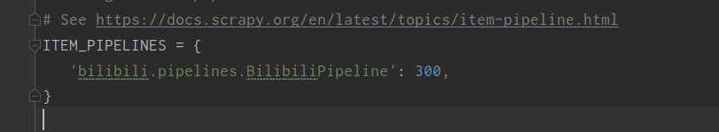

# Scrapy

## 一、Scrapy介绍

### 1.1 Scrapy结构

Scrapy是一个为了爬取网站数据，提取结构性数据而编写的应用框架。 可以应用在包括数据挖掘，信息处理或存储历史数据等一系列的程序中。


• Scrapy Engine(引擎)：负责Spider、ItemPipeline、Downloader、Scheduler中间的通讯，信号、数据传递等。

• Scheduler(调度器)：它负责接受引擎发送过来的Request请求，并按照一定的方式进行整理排列，入队，当引擎需要时，交还给引擎。

• Downloader（下载器）：负责下载Scrapy Engine(引擎)发送的所有Requests请求，并将其获取到的Responses交还给Scrapy Engine(引擎)，由引擎交给Spider来处理。

• Spider（爬虫）：它负责处理所有Responses,从中分析提取数据，获取Item字段需要的数据，并将需要跟进的URL提交给引擎，再次进入Scheduler(调度器)。

• Item Pipeline(管道)：它负责处理Spider中获取到的Item，并进行进行后期处理（详细分析、过滤、存储等）的地方。

• Downloader Middlewares（下载中间件）：一个可以自定义扩展下载功能的组件。

• Spider Middlewares（Spider中间件）：一个可以自定扩展和操作引擎和Spider中间通信的功能组件。

### 1.2 python安装Scrapy

+ 直接使用pip 安装会出现Twisted安装错误
+ 先安装Twisted:根据电脑配置下载

```
pip install Twisted-20.3.0-cp38-cp38-win_amd64.whl
```

+ 安装成功

```
pip install scrapy
```


## 二、Scrapy工程项目快速搭建

### 2.1 创建爬虫项目

```cmd
scrapy startproject <project_name>
```

+ 例如

```
scrapy startproject bilibili
```

+ 完成后文件下的内容为:


+ 使用DOS指令查看工程文件夹结构

```
tree/f
```


- scrapy.cfg：配置文件

​                  setting：定义默认的配置文件settings的位置是在项目模块下的settings文件

​                  deploy：定义项目名称

- spiders：存放你Spider文件，也就是你爬取的py文件

- items.py：相当于一个容器，和字典较像

- middlewares.py：定义Downloader Middlewares(下载器中间件)和Spider Middlewares(蜘蛛中间件)的实现

- pipelines.py:定义Item Pipeline的实现，实现数据的清洗，储存，验证。

- settings.py：全局配置

### 2.2 创建爬虫

+ 进入创建的项目文件夹

```
cd <project_name>
```

+ 创建爬虫文件
  + name:文件名称与项目名称不能一样
  + domain：爬取的网站地址

```
scrapy genspider [-t template] <name> <domain>
```

+ 例如：

```
cd bilibili
```

```
scrapy genspider rankdata http://https://www.bilibili.com/ranking/all/0/0/3/
```


### 2.3 检测程序与网站的连接

+ 测试

```
scrapy shell domain
```

```
scrapy shell www.bilibili.com
```

###  2.4 设置user-agent用户代理信息，随机轮循

通过 rotate_useragent.py 我们可以快速得到一个user-agent的列表，并实现自动随机选取。

•    将 rotate_useragent.py 拷贝到工程项目中。


设置 setting.py rotate_useragent.py  user-agent


或者在setting.py 中设置：

```python
# 防止反爬
DEFAULT_REQUEST_HEADERS = {
    'User-Agent': 'Mozilla/5.0',
    'Accept': 'textml,application/xhtml+xml,application/xml;q=0.9,*/*;q=0.8',
    'Accept-Language': 'en',
}
```

### 2.5 启动爬虫

```
scrapy runspider <spider_file.py>
```

```python
scrapy crawl <spider_name>
```

## 三、案例-爬取B站

### 3.1 在item.py中指定要爬取的字段

```python
import scrapy


class BilibiliItem(scrapy.Item):
    # define the fields for your item here like:
    # name = scrapy.Field()
    # 排名
    rank = scrapy.Field()
    # 名字
    name = scrapy.Field()
    # 作者
    author = scrapy.Field()
    # 链接
    link = scrapy.Field()
    # 播放量
    play = scrapy.Field()
    #弹幕
    view = scrapy.Field()
    # 评分
    rate = scrapy.Field()
    # 图片
    img = scrapy.Field()
    pass
```

### 3.2 在rankdata.py爬取内容

```python
# -*- coding: utf-8 -*-
import scrapy
# 导入字段对象
from bilibili.items import BilibiliItem

class RankdataSpider(scrapy.Spider):
    # 定义spider_name
    name = 'rankdata'
    allowed_domains = ['https://www.bilibili.com/ranking/all/0/0/3']
    start_urls = ['http://https://www.bilibili.com/ranking/all/0/0/3/']

    def parse(self, response):
        # xpth解析 获取HTML
        video_item = response.xpath('//li[@class="rank-item"]')
        for item in video_item:
            print("+++++++++++++++++")

            # 创建一个实例对象
            video = BilibiliItem()
            # 获取字段
            video['rank'] = item.xpath('./div[@class="num"]/text()').extract()[0]
            video['name'] = item.xpath('./div[@class="content"]/div[@class="info"]/a/text()').extract()[0]
            video['author'] = item.xpath(
                './div[@class="content"]/div[@class="info"]/div[@class="detail"]/a/span/text()').extract()[0]
            video['play'] = item.xpath(
                './div[@class="content"]/div[@class="info"]/div[@class="detail"]/span[@class="data-box"][1]/text()').extract()[
                0]
            video['view'] = item.xpath(
                './div[@class="content"]/div[@class="info"]/div[@class="detail"]/span[@class="data-box"][2]/text()').extract()[
                0]
            video['link'] = item.xpath('./div[@class="content"]/div[@class="img"]/a/@href').extract()[0]
            video['rate'] = item.xpath(
                './div[@class="content"]/div[@class="info"]/div[@class="pts"]/div/text()').extract()[0]
            video['img'] = item.xpath('./div[@class="content"]/div[@class="img"]/a/div/img/@src').extract()[0]

            # 生成器
            yield video

        pass

```

### 3.3 在pipelines.py打印要输出的内容

```python
class BilibiliPipeline(object):


    def process_item(self, item, spider):
        # 输出
        print('视频排名 : {}'.format(item['rank']))
        print('视频名字 : {}'.format(item['name']))
        print('视频作者 : {}'.format(item['author']))
        print('视频播放 : {}'.format(item['play']))
        print('视频弹幕 : {}'.format(item['view']))
        print('视频评分 : {}'.format(item['rate']))
        print('视频链接 : {}'.format(item['link']))
        print('视频图片 : {}'.format(item['img']))
        return item

```

#### 注意：此时还没有完成

### 3.4 在setting.py文件中设置执行流的优先级



+ 开启下载中间件


### 3.5 运行截图


#### 注意：此时发现img里面的内容为空！！！

因为B站上的图片是要滑动到当前才能爬取

##### 所以：Scrapy+ChromeDriver+Selenium爬取动态html页面

Selenium是一个自动化的测试工具，这里主要用到了它的Webdriver操作浏览器。

### 3.6 在middlewares.py设置请求

```python
 def process_request(self, request, spider):
        spider.driver = webdriver.Chrome(
            "E:\\py_code\\scrapy\\bilibili\\chromedriver.exe")

        if spider.name == "rankdata":
            spider.driver.get(request.url)
            for x in range(1, 101):
                height = float(x) / 101
                js = "document.documentElement.scrollTop = document.documentElement.scrollHeight * %f" % height
                spider.driver.execute_script(js)
                time.sleep(0.1)

            for x in range(100, 0 - 1):
                height = float(x) / 101
                js = "document.documentElement.scrollTop = document.documentElement.scrollHeight * %f" % height
                spider.driver.execute_script(js)
                time.sleep(0.1)

            origin_code = spider.driver.page_source
            res = HtmlResponse(url=request.url, encoding='utf8', body=origin_code, request=request)
            spider.driver.close()
            return res
```


### 3.7 运行结果


## 四、写入文件

### 4.1 写入csv文件

```python
# 写入csv文件
class CsvPipeline(object):

    def process_item(self, item, spider):
        with open("哔哩哔哩.csv", "a", newline="", encoding='utf-8')as csvfile:
            headers = ["name", "rate", "link", "view", "author", "rank", "play", "img"]
            keys = [k for k in headers]
            writer = csv.DictWriter(csvfile, fieldnames=keys)
            writer.writeheader()
            writer.writerow(item)
        return item

    def close_spider(self, spider):
        print("写入csv文件完毕")
```


### 4.2 写入Json文件

```python
# 写入json文件
class JsonPipeline(object):

    def process_item(self, item, spider):
        with codecs.open('哔哩哔哩.json', 'a', encoding='utf-8') as jf:
            file = json.dumps(dict(item), ensure_ascii=False) + '\n'
            jf.write(file)

        return item

    def close_spider(self, spider):
        print("写入json文件完毕")
```


### 4.3写入Excel文件

```python
# 写入Excel文件
class ExcelPipeline(object):
    # 定义构造函数
    def __init__(self):
        # 创建workbook对象
        self.wb = Workbook()
        self.ws = self.wb.active
        # 表头
        self.ws.append(["排名", "名字", "作者", "播放量", "弹幕", "评分", "链接", "图片"])

    def process_item(self, item, spider):
        # 写入Excel文件
        line = [item['rank'], item['name'], item['author'], item['play'], item['view'], item['rate'],
                item['link'], item['img']]
        self.ws.append(line)
        return item

    def close_spider(self, spider):
        self.wb.save('哔哩哔哩.xlsx')
        print("写入excel数据完毕")

```


### 4.4写入mysql数据库

```python
# 写入mysql
class MysqlPipeline(object):
    def __init__(self):
        # 和本地数据库建立连接
        self.db = pymysql.connect(host='localhost', port=3306, user='root', password='123456', db='mysql',
                                  charset='utf8')
        # 使用cursor()方法获取操作游标
        self.cursor = self.db.cursor()
        dropSql = 'drop table if exists bili'
        self.cursor.execute(dropSql)
        # 创建表
        createSql = """create table bili(
               rankId int primary key auto_increment,
               name varchar(50) not null,
               author varchar(50)not null,
               play varchar(50) not null,
               view varchar(50) not null,
               rate varchar(50) not null,
               link varchar(200) not null,
               img varchar(250) not null ); """

        self.cursor.execute(createSql)

    def process_item(self, item, spider):

        try:
            # 插入数据
            data = (escape_string(item['rank']), escape_string(item['name']), escape_string(item['author']),
                    escape_string(item['play']),
                    escape_string(item['view']), escape_string(item['rate']),
                    escape_string(item['link']), escape_string(item['img']))
            insertSql = 'insert into bili values(%s,%s,%s,%s,%s,%s,%s,%s);'

            self.cursor.execute(insertSql, data)

            self.db.commit()
            # self.cursor.close()
        finally:
            # 提交
            return item

    def close_spider(self, spider):
        print("写入mysql数据完毕")
        self.db.close()


```


### 4.5写入log日志

+ 在setting.py文件中写入

```python
import time
import os
# 日志文件
dirPath = os.path.join(os.getcwd(), "log")
if not os.path.exists(dirPath):
    os.makedirs(dirPath)
logFileName = time.strftime("%Y%m%d%H%M%S", time.localtime())+ '.log'
logpath = dirPath + os.sep + logFileName
LOG_LEVEL = "WARNING"  //设置日志级别
LOG_FILE = logpath

```

+ 在rankdata.py中

```python
        # 日志输出
        logging.warning("这是一个异常")
```


### 4.6下载图片

```python
# 创建下载资源进程类
class DownloadFileThread(threading.Thread):
    def __init__(self, url, savePath, fileName):
        threading.Thread.__init__(self)
        self.__url = url
        self.__savePath = savePath
        self.__fileName = fileName

    def run(self):
        print("【启动】>>> {} 文件开始下载".format(self.__fileName))
        request.urlretrieve(self.__url, self.__savePath)
        print("【完成】>>> {} 文件下载完毕".format(self.__fileName))


# 下载图片
class ImagePipeline(object):
    # 存储路径
    path = os.path.join(os.getcwd(), "images")
    if not os.path.exists(path):
        os.mkdir(path)

    def process_item(self, item, spider):
        filename = item['img'].split('/')[-1]
        download = DownloadFileThread(item['img'], os.path.join("images", filename), filename)
        download.start()
        download.join()

```


### 4.7 运行优先级:数字越小先运行

```python
ITEM_PIPELINES = {
    'bilibili.pipelines.BilibiliPipeline': 100,
    'bilibili.pipelines.ImagePipeline': 400,
    'bilibili.pipelines.JsonPipeline': 300,
    'bilibili.pipelines.CsvPipeline': 300,
    'bilibili.pipelines.ExcelPipeline': 200,
    'bilibili.pipelines.MysqlPipeline': 200
}
```

